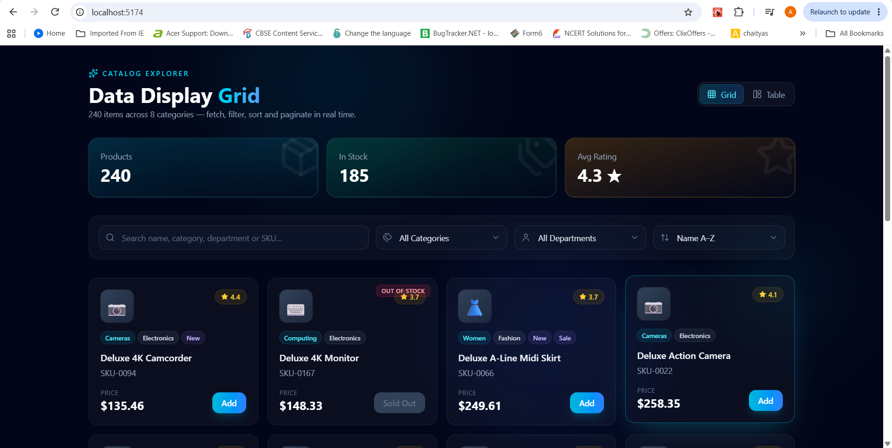
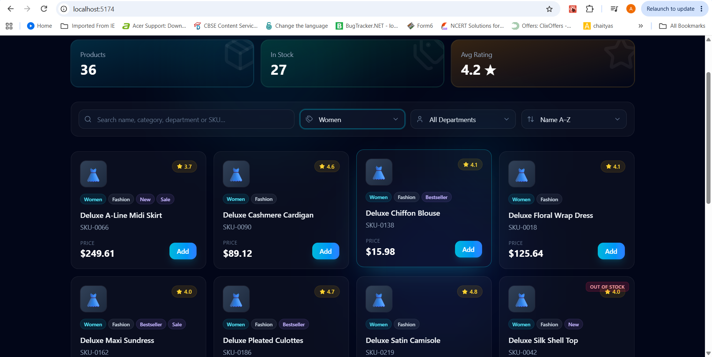
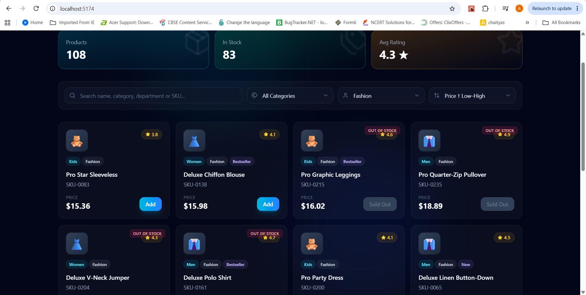
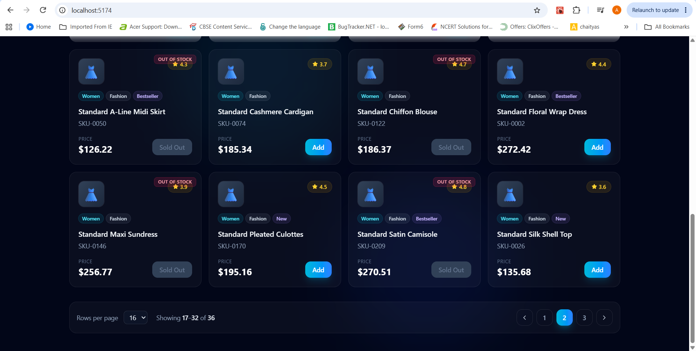

# Catalog Explorer

> A responsive product data-grid application for exploring, filtering, sorting, and paginating 240 catalog items in real time.



## Overview

Catalog Explorer is an interactive product catalog dashboard built to manage and explore a collection of 240 products across 8 categories.

The application allows users to filter products by category and department, sort products by name, price, rating, category, or stock availability, and navigate results through pagination controls.

It is designed to demonstrate clean data handling, responsive UI design, and practical e-commerce dashboard functionality.

## Features

- Displays 240 products across 8 categories
- Shows key catalog statistics:
  - Total products: 240
  - In-stock products: 185
  - Average product rating: 4.3★
- Category filtering for:
  - Men
  - Women
  - Kids
  - Audio
  - Wearables
  - Cameras
  - Computing
  - Home
- Department filtering for Fashion and Electronics
- Multiple sorting options:
  - Name A–Z
  - Name Z–A
  - Category A–Z
  - Price: Low–High
  - Price: High–Low
  - Rating: High–Low
  - Stock: High–Low
- Pagination with configurable rows per page
- Product availability indicators:
  - In Stock
  - Sold Out
- Product badges:
  - New
  - Sale
  - Bestseller
- Product details including SKU, price, category, department, and rating

## Screenshots

### Default Catalog View


The default dashboard shows summary statistics, category filters, department filters, sorting controls, products, stock status, and pagination.

### Category Filtering



Users can select categories such as Cameras, Women, Men, Audio, or Computing to view relevant products instantly.

### Department Filtering


The department filter helps users narrow the product catalog to Fashion or Electronics items.

### Price Sorting



Products can be sorted by price from low to high or from high to low.

### Pagination



The application supports page navigation and allows users to choose how many products to display per page.

## Product Data

Each product includes information such as:

- Product name
- SKU
- Category
- Department
- Price
- Rating
- Stock availability
- Promotional badges
- Product image or icon

Example product object:

```json
{
  "id": "SKU-0094",
  "name": "Deluxe 4K Camcorder",
  "category": "Cameras",
  "department": "Electronics",
  "price": 135.46,
  "rating": 4.4,
  "stockStatus": "In Stock",
  "badges": ["new", "sale"]
}
```

## Tech Stack

Update this section to match the technologies you used.

- React
- JavaScript or TypeScript
- HTML5
- CSS3
- Tailwind CSS or CSS Modules
- Custom data grid or table component
- Local JSON data or API-based product data

## How It Works

1. Product data is loaded into the application.
2. Users choose a category or department filter.
3. The product list updates based on selected filters.
4. Users can apply a sorting option, such as price or rating.
5. The filtered and sorted results are displayed using pagination.
6. Users can change the current page or rows displayed per page.

## Key Learnings

Through this project, I practiced:

- Managing product data in a user interface
- Building dynamic filtering functionality
- Implementing sorting logic for multiple fields
- Creating pagination controls
- Designing data-heavy interfaces
- Displaying stock status and product badges clearly
- Building responsive, user-friendly dashboard layouts

## Future Improvements

- Add product search by name or SKU
- Add multi-category selection
- Add a price-range filter
- Add rating-based filtering
- Add dark mode
- Add product detail pages
- Connect the project to a real backend API
- Add server-side filtering, sorting, and pagination
- Add CSV export for filtered product data

## Project Structure

```text
catalog-explorer/
├── public/
├── src/
│   ├── components/
│   ├── data/
│   ├── hooks/
│   ├── pages/
│   ├── App.jsx
│   └── main.jsx
├── screenshots/
│   ├── catalog-overview.png
│   ├── category-filter.png
│   ├── department-filter.png
│   ├── price-sorting.png
│   └── pagination.png
├── package.json
└── README.md
```

## Installation

```bash
git clone [https://github.com/YOUR-USERNAME/catalog-explorer.git](https://github.com/YOUR-USERNAME/catalog-explorer.git)
cd catalog-explorer
npm install
npm run dev
```

Open the local development URL shown in the terminal, usually:

```text
http://localhost:5173
```

## Live Demo

Add your deployed project link here:

```md
[View Live Demo](http://localhost:5177/)
```

## Author

**Aaryani Bharathiraja**

Student Developer | Portfolio Project